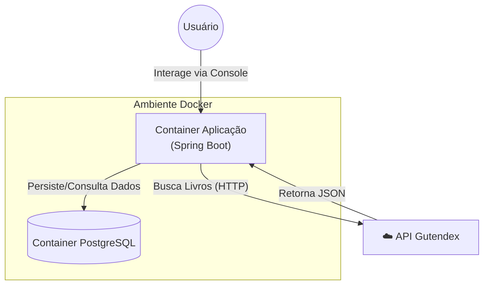
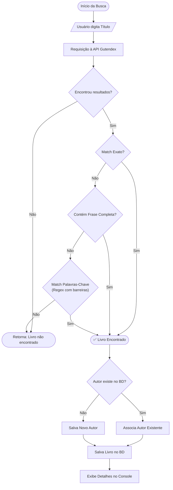

# 📚 LiterAura - Catálogo de Livros Interativo


Bem-vindo ao **LiterAlura**! Este é uma aplicação backend desenvolvida em Java 25 com Spring Boot que funciona como um catálogo de livros interativo via console. O sistema consome a API pública do **Gutendex** (Projeto Gutenberg), processa os dados e os persiste em um banco de dados relacional (PostgreSQL) para consultas futuras.

## 🧠 Arquitetura e Fluxo de Dados

### 1. Visão Geral do Sistema
O diagrama abaixo mostra como os componentes interagem entre si dentro do ambiente Docker.



### 2. Fluxo de Busca Inteligente (Algoritmo)
Implementamos uma lógica em camadas para garantir que o livro correto seja encontrado, utilizando Regex com barreiras de palavra para evitar correspondências parciais incorretas.



---

## 🚀 Funcionalidades

1.  **🔍 Buscar livro pelo título:** Conecta-se à API e utiliza o algoritmo de busca inteligente.
2.  **📚 Listar livros registrados:** Exibe todos os livros salvos localmente.
3.  **✍️ Listar autores registrados:** Mostra autores e seus livros.
4.  **📅 Listar autores vivos em determinado ano:** Filtro histórico de autores.
5.  **🌐 Listar livros em determinado idioma:** Filtro por código de idioma (EN, PT, etc.).

---

## 🛠️ Tecnologias Utilizadas

*   **Java 25 LTS:** Versão mais recente e performática da linguagem.
*   **Spring Boot 3.4.13:** Framework atualizado para produtividade.
*   **Spring Data JPA:** Persistência de dados robusta.
*   **PostgreSQL 16:** Banco de dados relacional moderno.
*   **Docker & Docker Compose:** Containerização completa do ambiente.
*   **JUnit 5 & Mockito:** Suíte de testes automatizados de alta fidelidade.

---

## 🧪 Testes Automatizados Robustos

O projeto utiliza uma suíte de testes profissional para garantir a confiabilidade:

*   **Testes de Repositório (`DataJpaTest`):** Valida queries complexas e integridade do banco de dados (PostgreSQL 16).
*   **Testes Unitários de Serviço (`Mockito`):** Valida o algoritmo de busca e filtros de forma isolada e rápida.

Para rodar os testes:
```bash
./scripts/test.sh
```

---

## 🐳 Como Executar o Projeto

1.  **Reconstrução Completa (Primeira vez ou mudanças no código):**
    ```bash
    ./scripts/rebuild.sh
    ```
2.  **Inicialização Simples (Apenas para rodar):**
    ```bash
    ./scripts/start.sh
    ```

Ambos os scripts iniciam a aplicação em modo interativo direto no seu terminal.


